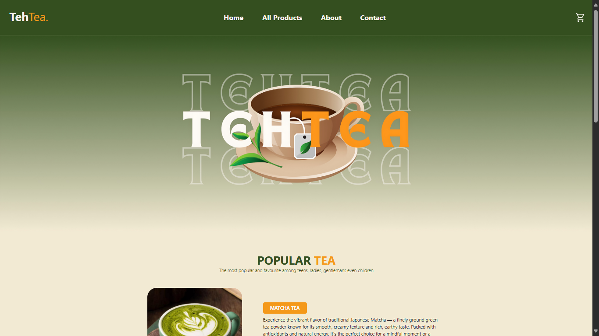
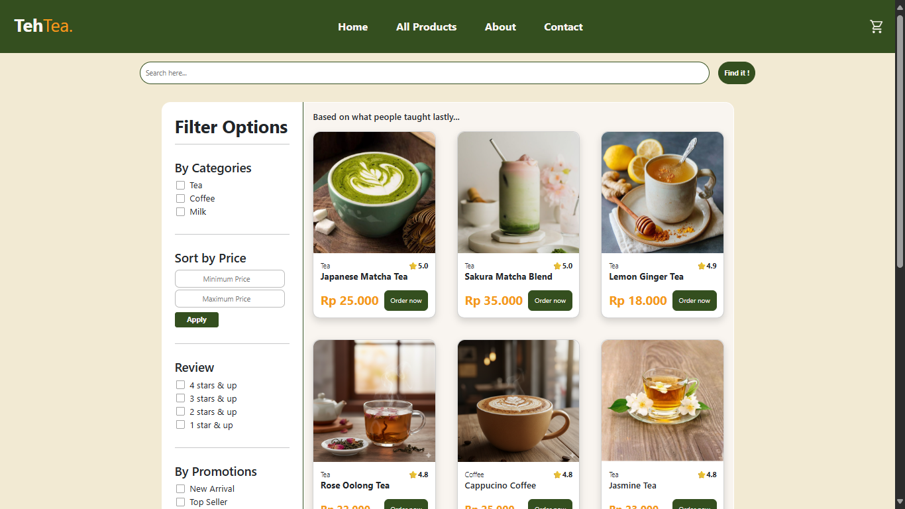

# TehTea - Simple Tea Store

Deskripsi singkat
-----------------
TehTea adalah sebuah toko online sederhana untuk produk teh yang dibuat sebagai proyek front-end statis. Proyek ini berfokus pada tampilan antarmuka (UI) dan pengalaman pengguna dasar untuk melihat produk, menambahkan ke keranjang, serta halaman detail produk. Proyek ini dibangun menggunakan HTML, CSS, dan JavaScript vanilla (tidak ada backend).

Fitur
-----
- Halaman beranda menampilkan produk teh.
- Halaman detail produk.
- Keranjang belanja sederhana (front-end only).
- Responsif dasar untuk tampilan mobile dan desktop.
- Mudah disesuaikan dan dikembangkan lebih lanjut.

Tangkapan layar (Screenshots)
----------------------------
> Gantilah file gambar di folder `assets/` dengan tangkapan layar asli situs Anda.

Deskripsi: Tampilan beranda dengan daftar produk.

Deskripsi: Halaman detail produk menampilkan informasi dan tombol tambah ke keranjang.

Cara menjalankan (lokal)
------------------------
1. Clone repositori:
   git clone https://github.com/Mhmd7uLL/TehTea-SimpleTeaStore.git

2. Masuk ke folder proyek:
   cd TehTea-SimpleTeaStore

3. Buka `index.html` di browser:
   - Klik dua kali `index.html`, atau
   - Jalankan Live Server (VS Code) untuk pengalaman yang lebih baik.

Struktur folder (singkat)
-------------------------
- index.html — Halaman utama
- product.html — Halaman detail all produk
- about.html — Halaman kisah toko dan wajah karyawan
- contact.html — Halaman contact yang berisi form untuk kritik dan saran
- style/ — Berisi file CSS
- js/ — Berisi file JavaScript
- src/ — Berbagai assets website
- assets/ — Tempat untuk screenshot dan gambar produk

Teknologi
---------
- HTML5
- CSS3
- JavaScript (vanilla)

Menambahkan screenshot ke README
--------------------------------
1. Buat folder `assets/` di root repository (jika belum ada).
2. Tambahkan file screenshot (mis. `screenshot-home.png`, `screenshot-product.png`, `screenshot-cart.png`).
3. Commit dan push:
   git add assets/
   git commit -m "Menambahkan screenshot situs"
   git push origin main

Kontribusi
----------
Kontribusi sangat disambut. Untuk kontribusi kecil:
1. Fork repositori.
2. Buat branch fitur: `git checkout -b fitur-nama`.
3. Commit perubahan Anda.
4. Buka pull request (PR) ke repositori utama.

Lisensi
-------
Tambahkan lisensi yang Anda inginkan (mis. MIT) dengan membuat file `LICENSE`.

Kontak
------
Jika ada pertanyaan atau ingin bantuan memasukkan screenshot ke repositori, hubungi pemilik: https://github.com/Mhmd7uLL

Catatan
------
- README ini menggunakan gambar placeholder. Gantilah `assets/*.png` dengan gambar asli hasil tangkapan layar situs Anda agar tampil di README.
- Jika Anda ingin, saya dapat membantu membuat commit yang menambahkan README ini langsung ke cabang baru di repositori dan memberikan instruksi langkah demi langkah untuk mengunggah screenshot.
